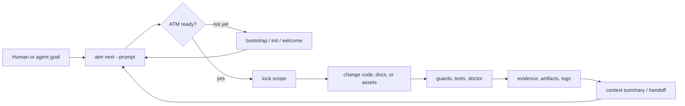
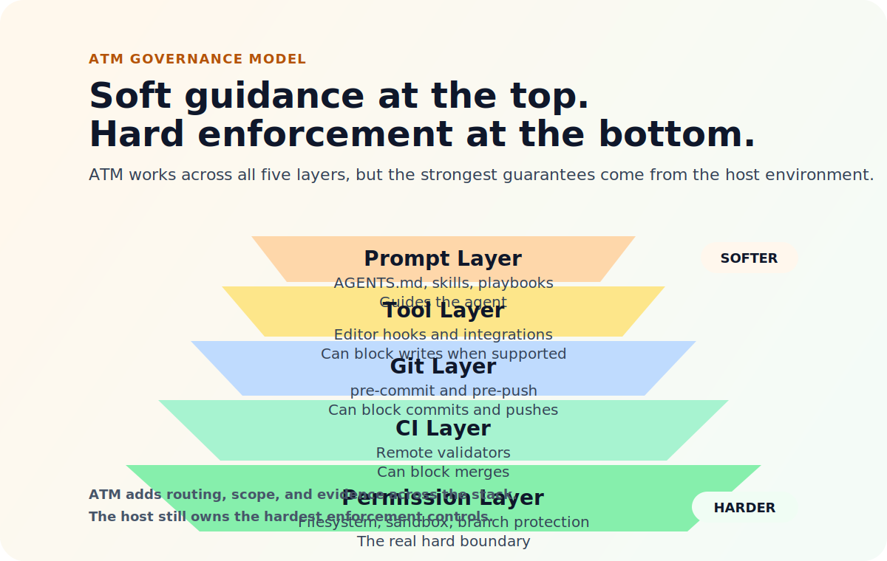

# AI-Atomic-Framework

[](https://github.com/eaglhuang/AI-Atomic-Framework/releases/tag/v0.9.0-alpha.1)
[](CITATION.cff)
[](https://github.com/eaglhuang/AI-Atomic-Framework/actions/workflows/ci.yml)
[](LICENSE)
[](package.json)
[](https://www.npmjs.com/)
[](docs/AGENT_PACK_ONBOARDING.md)
[](release/atm-onefile/atm.mjs)
[](release/atm-root-drop/)

[](#why-atm-exists)
[](#how-it-works)
[](#safety-model)
[](#for-ai-agents)

ATM helps people and AI agents work in the same repo without making a mess.

It tells the agent what to do next, keeps changes inside the right scope, and leaves clear proof of what changed and what passed.

It is not another chat agent or workflow app. It is the safety layer around AI-assisted engineering.

> For AI agents: read this README, then run `node atm.mjs next --prompt "<current user prompt>" --json`. Use `node atm.mjs next --json` only when there is no user prompt.

Captain/dispatch entry gate: if the user asks for Captain, Coordinator,
dispatch, task cards, sidecars, subagents, delegation, condition review, or
closeout work, first route the request through `ai-role-router` when available,
then through `atm-dispatch` before drafting instructions, delegating work, or
reviewing another agent. State `Skill used: atm-dispatch` and the chosen
`Delegation mode`. Internal sidecar is the default for review, preflight,
grep, checklist, planning-only checks, and post-report verification. External
dispatch is opt-in, and external write is forbidden unless the user explicitly
grants write authority and scope.

## Why ATM Exists

AI-assisted engineering breaks down in predictable ways when the working rules stay implicit:

- an agent edits before understanding local constraints;
- a large request gets handled without a scoped work boundary;
- validations run, but nobody can tell later what actually passed;
- review sees the final diff, but not the evidence or decision trail;
- handoff depends on chat history instead of durable project artifacts.

ATM gives repositories a shared operating contract for those moments. The goal is simple: an agent should be able to enter a repository, ask ATM what the next safe action is, do the work inside a declared boundary, and leave reviewable proof behind.

ATM is not just an atom runner. It is the route, scope, evidence, close, and handoff contract around AI-assisted work.

## What You Get

| Capability | What it provides |
| --- | --- |
| Deterministic routing | `atm next` recommends the official next action for a real user request. |
| Scope control | Locks file, package, or capability scope before mutation. |
| Evidence-first validation | `evidence run` turns guards, tests, reports, and logs into durable command-backed evidence instead of terminal noise. |
| First-touch onboarding | `atm welcome`, ATMChart, and agent integrations make the local route discoverable. |
| Portable contracts | Core contracts stay neutral across languages, repositories, and agent environments. |
| Replaceable governance bundle | Tasks, rules, artifacts, evidence, and adapters can be swapped without forking core semantics. |
| Atom behaviors | Work can split, merge, compose, evolve, expire, or absorb legacy code through governed behavior plugins. |

## 60-Second Start

> New to ATM? Start with [docs/ATM_NEW_USER_WORKFLOW.md](docs/ATM_NEW_USER_WORKFLOW.md) for the 7-step normal workflow before diving into the bootstrap routes below.

### Quick Verify for the Paper Evidence

```bash
git clone https://github.com/eaglhuang/AI-Atomic-Framework
cd AI-Atomic-Framework
git checkout v0.9.0-alpha.1
npm install
npm test -- broker/decision
npm run bench:admission:paper -- --seed 20260625
```

### Start a new governed project

```bash
npx create-atm test-app --agent claude-code
```

`create-atm` creates the project directory, runs the official ATM bootstrap, renders the ATMChart rule summary, and installs the selected agent integration. Omit `--agent` to initialize only the governed ATM project and rule chart.

### Add ATM to an existing repository

Use one official distribution:

| Distribution | Use when |
| --- | --- |
| `release/atm-root-drop/` | You want the portable multi-file bundle. |
| `release/atm-onefile/atm.mjs` | You want a single-file embedded runtime. |
| npm `create-atm` | You want the lowest-friction starter route. |

The bootstrap pattern is consistent: place an official ATM distribution in the target repository, make the ATM entry route visible to agents, and let `node atm.mjs next --prompt "<current user prompt>" --json` route user-requested governed work.

The release-bundle root-drop bootstrap workflow keeps that entry route portable for repositories that prefer a checked-in distribution over an npm starter.

### Give the agent one instruction

```text
Read README.md if present, then run "node atm.mjs next --prompt \"<current user prompt>\" --json" from the repository root before task work. If the result includes `ATM_USER_NOTICE` or `evidence.userNotice`, show it to the user before executing the returned command.
```

The first `next` call will route to bootstrap or orientation when the repository is not ready yet. After that, governed work keeps returning through `next`.

## For AI Agents

When you enter an ATM repository for user-requested work:

1. Read the repository entry guidance.
2. Run `node atm.mjs next --prompt "<current user prompt>" --json`.
3. Read `evidence.nextAction.playbook` before editing, closing, or committing.
4. Edit only within the allowed scope returned by ATM.
5. Run the smallest relevant validators and preserve the resulting evidence.

Important details for this framework repository:

- `node atm.mjs` runs the frozen built runner. Use it for normal governance routing and release-like validation.
- `node atm.dev.mjs` is for source-first ATM framework validation only. Do not use it as the default entrypoint for ordinary agent work.
- If ATM recommends `batch`, deliver only the queue head, run `node atm.mjs batch checkpoint --actor <id> --json`, and commit only after checkpoint succeeds.
- README files, generated agent entry files, shell wrappers, and integrations should guide an agent back to `node atm.mjs next --prompt "<current user prompt>" --json`; they should not create a second task model, approval workflow, or rule authority.

## How It Works



| Stage | Typical command | Expected result |
| --- | --- | --- |
| Route | `node atm.mjs next --prompt "<current user prompt>" --json` | The next governed action and playbook. |
| Bootstrap or orient | `node atm.mjs welcome --json` or init flow | A ready repository with visible local rules. |
| Lock | `atm lock` or channel-specific claim flow | A declared mutation boundary. |
| Work | Normal implementation commands | Actual code, docs, assets, or config changes. |
| Validate | `doctor`, guards, focused validators, tests | Evidence that the requested work passed the required gates. |
| Handoff | `atm handoff --help` | Durable context for the next human or agent pass. |

## Safety Model



ATM keeps the governance layer explicit:

- scope is locked before governed mutation;
- validators and guards are evidence, not just console output;
- artifacts, logs, and reports live in ATM-managed history;
- host-specific enforcement belongs in adapters, hooks, or plugins instead of `packages/core`;
- the deterministic router remains `next`, even when a repository installs welcome flows, agent packs, or shell shortcuts.

## Project Structure

| Path | Purpose |
| --- | --- |
| `packages/` | Framework packages such as core contracts, CLI, adapters, and plugins. |
| `release/` | Official release distributions, including the onefile and root-drop forms. |
| `docs/` | Public framework documentation and governance references. |
| `examples/` | Example adopter setups and integration patterns. |
| `.atm/` | ATM runtime state, evidence, integrations, and generated memory for the local repository. |
| `integrations/` | Agent-specific entry files and installable integration surfaces. |
| `scripts/` | Validators, builders, and framework maintenance tooling. |

## Framework Repo vs Adopter Repo

This repository is the public ATM framework repository, not an adopter project workspace.

Terminology boundary: ATM is the product, framework, CLI, and governance workflow. AI-Atomic-Framework is only this repository name; do not call ATM AAF or use AAF as a shorthand for the framework.

| Repository type | What to do | What not to do |
| --- | --- | --- |
| Framework repo | Keep public framework docs English-only, contributor-facing, and repository-neutral. | Do not store downstream project planning queues, host-specific operating notes, or adopter-only governance rules here. |
| Adopter repo | Keep the ATM route visible, install optional integrations, and layer host enforcement in hooks, CI, or review policy. | Do not replace ATM core contracts with a second registry, second task model, or a competing authority document. |

The Default Governance Bundle is the official default experience, but it is not a `packages/core` hard dependency. Core defines contracts; the default bundle is a reference implementation of those contracts.

## Core Commands

| Command | Purpose |
| --- | --- |
| `node atm.mjs next --prompt "<current user prompt>" --json` | Recommend the next official ATM action for the current user request. |
| `node atm.mjs next --json` | Read-only repository orientation when no user prompt is available. |
| `node atm.mjs welcome --json` | Summarize ATMChart, integration health, and the next ATM action for first-touch onboarding. |
| `node atm.mjs doctor --json` | Inspect engineering readiness, layout health, trust signals, version compatibility, and integration drift. |
| `node atm.mjs atm-chart render --json` | Render `.atm/memory/atm-chart.md` from guard sources and schema hashes. |
| `node atm.mjs atm-chart verify --json` | Verify ATMChart freshness and version compatibility. |
| `node atm.mjs integration list --json` | Inspect installed agent integration adapters and manifests. |
| `node atm.mjs lock --help` | Check, acquire, or release governed scope locks. |
| `node atm.mjs test --help` | Run atom smoke, spec, map integration, equivalence, or propagation tests. |
| `node atm.mjs handoff --help` | Write continuation summaries for governed work. |

Per-command help is command-spec driven. `node atm.mjs <command> --help` returns
the command summary, options, examples, and any richer guidance that the spec
declares, including required-flag sets, related commands, common mistakes, and
playbook-oriented notes when a command needs them.

For all available commands, run:

```bash
node atm.mjs --help
```

## Atomic Behaviors

The atom is the main ATM product idea. An atom is not just a task, ticket, command, or prompt. It behaves more like a governed cell in a living codebase: it can divide, fuse, form chains, evolve, go dormant, or attach itself to legacy tissue.

Core defines the `AtomBehavior` interface and evidence schema. Behavior plugins provide the actual moves, and every move should expose the same contract surface: trigger, evidence, gates, registry transition, and rollback.

| Behavior | What it means | Framework signal |
| --- | --- | --- |
| `behavior.split` | One crowded atom divides into two or more focused active atoms. | `split-plan`, new semantic fingerprints, `bornBy: split`. |
| `behavior.merge` | Several compatible atoms fuse into one clearer atom. | `merge-plan`, merged fingerprint, absorbed atoms marked deprecated. |
| `behavior.compose` | Active atoms line up into a reusable map or tree. | Map composition with `members[]` and `edges[]`. |
| `behavior.dedup-merge` | A duplicate atom is swallowed by the surviving atom. | Similarity report, dedup decision, caller refs redirected. |
| `behavior.sweep` | An unused atom goes dormant when nobody calls it. | Unused-caller report, `active -> deprecated`. |
| `behavior.evolve` | An atom keeps its identity while gaining a better version. | Upgrade proposal, quality comparison, automated gates. |
| `behavior.expire` | A deprecated atom reaches TTL and leaves the system. | Expiry report, `deprecated -> expired`. |
| `behavior.polymorphize` | One atom becomes a template with parameterized variants. | Polymorph template, dimension spec, lazy validated instances. |
| `behavior.infect` | An existing atom attaches to matching legacy code and becomes its caller target. | Infect plan, dry-run patch, caller refs added. |
| `behavior.atomize` | A legacy code region transforms into a new governed atom. | Atomize proposal, new atom spec, legacy mapping patch. |

The public behavior naming guidance lives in [docs/governance/behavior-taxonomy.md](docs/governance/behavior-taxonomy.md). The consolidated reference implementation lives in [packages/plugin-behavior-pack](packages/plugin-behavior-pack).

## Architecture In One Page

ATM is organized around contracts first. Implementations may vary, but the semantics should remain portable across languages, repositories, and agent environments.

| Layer | Owns | Must not do |
| --- | --- | --- |
| Core Contracts | `AtomicSpec`, registry records, work items, scope locks, evidence, artifacts, context summaries, adapter reports. | Import default plugins or assume one host layout. |
| Provisioning Facade | Atom and map birth through governed generators such as `ATM-CORE-0004` and `atm create`. | Create a second ID, path, or registry model. |
| Agent Operating Layer | First-touch guidance, AtomicCharter, ATMChart, welcome flow, run envelopes, handoff guidance. | Bind governance to one AI vendor, IDE, or prompt format. |
| Integration Adapters | Agent-native entry files, install/verify/remove lifecycle, `.atm/integrations/<id>.manifest.json`. | Become a second task store or approval workflow. |
| Default Governance Bundle | Replaceable starter plugins for tasks, locks, rules, context budgets, logs, artifacts, and evidence. | Become a hard dependency of `packages/core`. |
| Plugins and Host Adapters | Optional governance capabilities and host-specific storage, Git, CI, issue tracker, language, or runtime integrations. | Push host-specific rules back into core contracts. |

See [docs/ARCHITECTURE.md](docs/ARCHITECTURE.md) for the full layer model.

## Historical Batch Lane

For repositories migrating legacy work or completing offline task batches, ATM supports a **historical batch lane**. This allows operators to verify and close tasks using historical commit evidence rather than requiring a live active workspace mutation.

### Core Operations

1. **Author Batch Envelope:**
   Generate a verified historical batch JSON envelope by specifying the target tasks and commit range:
   ```bash
   node atm.mjs evidence historical-batch --tasks TASK-A,TASK-B --commits abc123,def456 --actor <actor-id> --validator-command "npm test" --write --json
   ```

2. **Close Task via Batch:**
   Consume the generated historical batch slice to transition the task status to done:
   ```bash
   node atm.mjs taskflow close --task TASK-A --actor <actor-id> --historical-batch hist-batch-YYYY-MM-DD.json --write --json
   ```

### Key Concepts

- **Coverage Status:** The batch validator maps the file diffs of the matched commits against each task's declared deliverables. If any file is missing, the task is marked as `partial`. It only becomes `complete` (and close-ready) when all declared deliverables are fully matched by the commit history.
- **Diagnostic-Only Behavior:** By default, if the batch validation lacks complete file coverage, the task will refuse to close unless an emergency approval is provided.
- **Validator Mapping:** Each command run in the batch is hashed and recorded, ensuring historical test execution can be proven cryptographically.

## Adopter Guidance

ATM is designed to cooperate with the systems a repository already has.

- Keep `node atm.mjs next --prompt "<current user prompt>" --json` visible in repository entry guidance for user-requested work.
- Use `atm welcome`, ATMChart, and optional integrations to help agents discover the local route.
- Use `atm doctor --json` to inspect readiness and detect possible governance bypass.
- Add Git hooks, CI gates, branch protection, or review policy in the host repository when stronger enforcement is needed.
- Keep host-specific escalation policy outside ATM core.

Host-side enforcement options are documented in [docs/HOST_GOVERNANCE_INTEGRATION.md](docs/HOST_GOVERNANCE_INTEGRATION.md). First-touch onboarding and integration manifests are documented in [docs/AGENT_PACK_ONBOARDING.md](docs/AGENT_PACK_ONBOARDING.md).

## Contributor Workflow

This repository uses npm as the official package-manager route and targets Node.js 24 for source-tree development. TypeScript modules run through `node --experimental-strip-types` in local validators and scripts.

The current implementation uses TypeScript, Node.js, JSON schemas, and a small CLI because those tools make the alpha path easy to inspect and test. That toolchain is a recommendation, not a semantic requirement of ATM; other implementations should remain possible if they preserve the same contracts.

Runner entrypoints are intentionally split:

| Entrypoint | Purpose |
| --- | --- |
| `node atm.mjs ...` | Stable frozen runner for agents, governance routing, and release-like tests inside this repo. It uses `release/atm-onefile/atm.mjs` when present, then the built `packages/cli/dist/atm.js`. |
| `node atm.dev.mjs ...` | Source-first runner for ATM framework development. Use this only when you intentionally need current `packages/cli/src/**` behavior before a build. |

Do not ask agents to use `node atm.dev.mjs` for ordinary governance tests. Build first, then verify the frozen entrypoint with `node atm.mjs ...`.

Install dependencies, then use the standard engineering checks:

```bash
npm install
npm run typecheck
npm run lint
npm test
```

Build and refresh distribution artifacts:

```bash
ATM_RETAIN_RELEASE_ARTIFACTS=1 npm run build
```

Run release-entry smoke checks:

```bash
node release/atm-root-drop/atm.mjs next --json
node release/atm-onefile/atm.mjs next --json
```

Broader validation profiles:

```bash
npm run validate:quick
npm run validate:standard
npm run validate:full
```

Protected-surface neutrality is a release concern. Before changing public docs, templates, examples, schemas, or framework package surfaces, review [docs/governance/DOCS_NEUTRALITY_AUDIT.md](docs/governance/DOCS_NEUTRALITY_AUDIT.md) and run:

```bash
npm run validate:neutrality
```

Versioning policy changes are self-versioned. Before changing release, compatibility matrix, deprecation, or migration policy text, update `policy_version` and confirm `framework_version_range` in [docs/ai_atomic_framework/upstream-versioning-policy.md](docs/ai_atomic_framework/upstream-versioning-policy.md), then run:

```bash
node --experimental-strip-types scripts/validate-policy-self-version.ts --mode validate
```

## What ATM Is Not

ATM is not trying to be:

- a general-purpose agent framework;
- a workflow engine;
- a prompt marketplace;
- a vector database;
- a model evaluation suite;
- a replacement for host project tests or CI;
- a required dependency for every downstream repository;
- a tool that assumes one programming language, editor, AI model, database, or issue tracker.

ATM can coexist with agent frameworks, specification-driven development tools, CI systems, issue trackers, Harness Engineering reporting, and workflow orchestrators. It provides the shared governance contract around that work. See [docs/ECOSYSTEM_POSITIONING.md](docs/ECOSYSTEM_POSITIONING.md).

## Documentation Map

| Topic | Start here |
| --- | --- |
| Architecture and package boundaries | [docs/ARCHITECTURE.md](docs/ARCHITECTURE.md) |
| First-touch onboarding and ATMChart | [docs/AGENT_PACK_ONBOARDING.md](docs/AGENT_PACK_ONBOARDING.md) |
| Host-side enforcement | [docs/HOST_GOVERNANCE_INTEGRATION.md](docs/HOST_GOVERNANCE_INTEGRATION.md) |
| Self-hosting alpha proof | [docs/SELF_HOSTING_ALPHA.md](docs/SELF_HOSTING_ALPHA.md) |
| Bug backlog router | [.agents/skills/atm-bug-backlog/SKILL.md](.agents/skills/atm-bug-backlog/SKILL.md) |
| ATM bug and optimization backlog | [docs/governance/atm-bug-and-optimization-backlog.md](docs/governance/atm-bug-and-optimization-backlog.md) |
| Atom creation and generator provenance | [docs/ATOM_GENERATOR.md](docs/ATOM_GENERATOR.md) |
| Atom workspace layout | [docs/ATOM_SPACE_LAYOUT.md](docs/ATOM_SPACE_LAYOUT.md) |
| Atomic map replacement | [docs/MAP_REPLACEMENT_PROTOCOL.md](docs/MAP_REPLACEMENT_PROTOCOL.md) |
| Long-tail adopter safeguards | [docs/LONGTAIL_USERS.md](docs/LONGTAIL_USERS.md) |
| Contributing | [CONTRIBUTING.md](CONTRIBUTING.md) |
