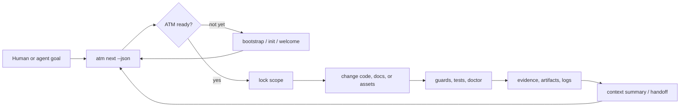
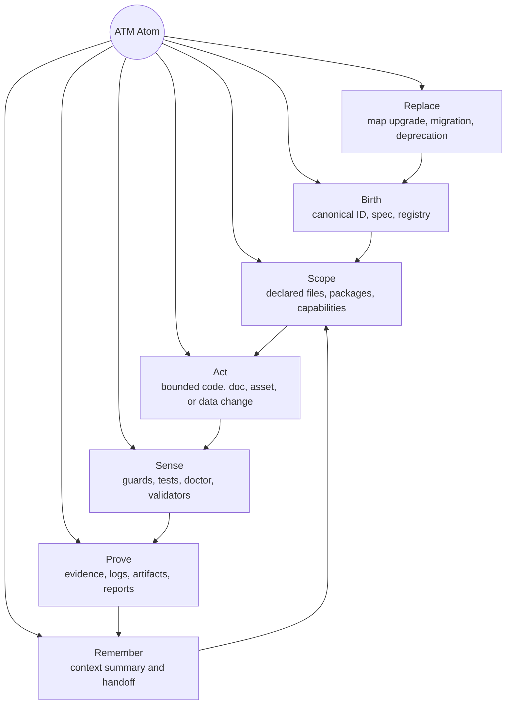

# AI-Atomic-Framework

[](https://github.com/eaglhuang/AI-Atomic-Framework/actions/workflows/ci.yml)

AI-Atomic-Framework, also called ATM in this repository, is a governance framework for AI-assisted engineering work. It is not just an atom runner. It helps humans and AI agents make changes through an inspectable loop: understand the next governed action, lock the intended scope, run deterministic checks, preserve evidence, and hand off enough context for the next iteration.

ATM is not an agent framework and not a workflow engine. It is the control layer around AI-assisted work: the part that keeps scope, rules, validation, artifacts, evidence, and handoff state explicit.

> Agent first action: read this README, then run `node atm.mjs next --json` from the repository root, and execute the returned command.

## What ATM Does

ATM gives a repository a repeatable work envelope:

- models AI-assisted work as atoms with explicit birth, scope, action, proof, memory, and replacement behavior;
- turns large goals into governed work items;
- locks file, package, or capability scope before mutation;
- runs guards, tests, and validation as evidence, not just as terminal noise;
- records artifacts, logs, reports, and context summaries under ATM-managed history;
- keeps host-specific policy in adapters or plugins instead of hard-coding it into core;
- lets a downstream project adopt the default governance bundle or map ATM contracts onto its own systems.

The practical result is simple: an AI agent can enter a repository, ask ATM what the next safe action is, do the work inside a declared boundary, and leave reviewable proof behind.

## How It Works



The key idea is that `next` remains the deterministic router. README files, generated agent entry files, shell wrappers, and integrations should guide an agent back to `node atm.mjs next --json`; they should not create a second task model, approval workflow, or rule authority.

## Atomic Behaviors

The atom is the main ATM product idea. An atom is not just a task, ticket, command, or prompt. It is a governed unit of work with lifecycle behavior that humans can review and agents can repeat.



| Behavior | Human meaning | Framework signal |
| --- | --- | --- |
| Birth | Work starts from a named, inspectable unit instead of an ad hoc prompt. | Atomic ID, spec, registry entry, generator provenance. |
| Scope | The mutation boundary is known before files change. | Scope lock, package boundary, path ownership, capability lock. |
| Act | The agent performs the smallest useful change inside the boundary. | Atom run, map step, implementation command, host adapter action. |
| Sense | The atom checks whether reality still matches the contract. | Guards, tests, `doctor`, validators, schema checks. |
| Prove | Results become review material, not just terminal output. | Evidence records, artifacts, logs, validation reports. |
| Remember | The next human or agent can continue without reconstructing everything. | Context summary, handoff note, continuation state. |
| Replace | Existing atoms and maps can evolve without breaking their public meaning. | Replacement protocol, migration record, compatibility signal. |

## 60-Second Adoption

Use the npm starter when you want a fresh governed project:

```bash
npx create-atm test-app --agent claude-code
```

`create-atm` creates the project directory, runs the official ATM bootstrap, renders the ATMChart rule summary, and installs the selected agent integration. Omit `--agent` to initialize only the governed ATM project and rule chart.

For an existing repository, use one official distribution:

| Distribution | Use when |
| --- | --- |
| `release/atm-root-drop/` | You want the portable multi-file bundle. |
| `release/atm-onefile/atm.mjs` | You want a single-file embedded runtime. |
| npm `create-atm` | You want the lowest-friction starter route. |

This is the release-bundle root-drop bootstrap workflow: place an official ATM distribution in the target repository, make the ATM entry route visible to agents, and let `node atm.mjs next --json` route bootstrap, orientation, and governed work.

Then give your AI agent one instruction:

```text
Read README.md if present, then run "node atm.mjs next --json" from the repository root and execute the returned command.
```

The first `next` call will route to bootstrap or orientation when the repository is not ready yet. After that, governed work keeps returning through `next`.

## Core Commands

| Command | Purpose |
| --- | --- |
| `node atm.mjs next --json` | Recommend the next official ATM action from the current repository state. |
| `node atm.mjs welcome --json` | Summarize ATMChart, integration health, and the next ATM action for first-touch onboarding. |
| `node atm.mjs doctor --json` | Inspect engineering readiness, layout health, trust signals, version compatibility, and integration drift. |
| `node atm.mjs atm-chart render --json` | Render `.atm/memory/atm-chart.md` from guard sources and schema hashes. |
| `node atm.mjs atm-chart verify --json` | Verify ATMChart freshness and version compatibility. |
| `node atm.mjs integration list --json` | Inspect installed agent integration adapters and manifests. |
| `node atm.mjs lock --help` | Check, acquire, or release governed scope locks. |
| `node atm.mjs test --help` | Run atom smoke, spec, map integration, equivalence, or propagation tests. |
| `node atm.mjs handoff --help` | Write continuation summaries for governed work. |

For all available commands, run:

```bash
node atm.mjs --help
```

## Architecture In One Page

ATM is organized around contracts first. Implementations may vary, but the semantics should remain portable across languages, repositories, and agent environments.

| Layer | Owns | Must not do |
| --- | --- | --- |
| Core Contracts | `AtomicSpec`, registry records, work items, scope locks, evidence, artifacts, context summaries, adapter reports. | Import default plugins or assume one host layout. |
| Provisioning Facade | Atom and map birth through governed generators such as `ATM-CORE-0004` and `atm create`. | Create a second ID, path, or registry model. |
| Agent Operating Layer | First-touch guidance, AtomicCharter, ATMChart, welcome flow, run envelopes, handoff guidance. | Bind governance to one AI vendor, IDE, or prompt format. |
| Integration Adapters | Agent-native entry files, install/verify/remove lifecycle, `.atm/integrations/<id>.manifest.json`. | Become a second task store or approval workflow. |
| Default Governance Bundle | Replaceable starter plugins for tasks, locks, rules, context budgets, logs, artifacts, and evidence. | Become a hard dependency of `packages/core`. |
| Plugins and Host Adapters | Optional governance capabilities and host-specific storage, Git, CI, issue tracker, language, or runtime integrations. | Push host-specific rules back into core contracts. |

The Default Governance Bundle is the official default experience, but it is not a `packages/core` hard dependency. Core defines contracts; the default bundle is a reference implementation of those contracts.

See [docs/ARCHITECTURE.md](docs/ARCHITECTURE.md) for the full layer model.

## Adopter Guidance

ATM is designed to cooperate with the systems a repository already has.

- Keep `node atm.mjs next --json` visible in repository entry guidance.
- Use `atm welcome`, ATMChart, and optional integrations to help agents discover the local route.
- Use `atm doctor --json` to inspect readiness and detect possible governance bypass.
- Add Git hooks, CI gates, branch protection, or review policy in the host repository when stronger enforcement is needed.
- Keep host-specific escalation policy outside ATM core.

Host-side enforcement options are documented in [docs/HOST_GOVERNANCE_INTEGRATION.md](docs/HOST_GOVERNANCE_INTEGRATION.md). First-touch onboarding and integration manifests are documented in [docs/AGENT_PACK_ONBOARDING.md](docs/AGENT_PACK_ONBOARDING.md).

## Contributor Workflow

This repository uses npm as the official package-manager route and targets Node.js 24 for source-tree development. TypeScript modules run through `node --experimental-strip-types` in local validators and scripts.

The current implementation uses TypeScript, Node.js, JSON schemas, and a small CLI because those tools make the alpha path easy to inspect and test. That toolchain is a recommendation, not a semantic requirement of ATM; other implementations should remain possible if they preserve the same contracts.

Install dependencies, then use the standard engineering checks:

```bash
npm install
npm run typecheck
npm run lint
npm test
```

Build and refresh distribution artifacts:

```bash
npm run build
```

Run release-entry smoke checks:

```bash
node release/atm-root-drop/atm.mjs next --json
node release/atm-onefile/atm.mjs next --json
```

Broader validation profiles:

```bash
npm run validate:quick
npm run validate:standard
npm run validate:full
```

Protected-surface neutrality is a release concern. Before changing public docs, templates, examples, schemas, or framework package surfaces, review [docs/governance/DOCS_NEUTRALITY_AUDIT.md](docs/governance/DOCS_NEUTRALITY_AUDIT.md) and run:

```bash
npm run validate:neutrality
```

Versioning policy changes are self-versioned. Before changing release, compatibility matrix, deprecation, or migration policy text, update `policy_version` and confirm `framework_version_range` in [docs/ai_atomic_framework/upstream-versioning-policy.md](docs/ai_atomic_framework/upstream-versioning-policy.md), then run:

```bash
node --experimental-strip-types scripts/validate-policy-self-version.ts --mode validate
```

## What ATM Is Not

ATM is not trying to be:

- a general-purpose agent framework;
- a workflow engine;
- a prompt marketplace;
- a vector database;
- a model evaluation suite;
- a replacement for host project tests or CI;
- a required dependency for every downstream repository;
- a tool that assumes one programming language, editor, AI model, database, or issue tracker.

ATM can coexist with agent frameworks, specification-driven development tools, CI systems, issue trackers, Harness Engineering reporting, and workflow orchestrators. It provides the shared governance contract around that work. See [docs/ECOSYSTEM_POSITIONING.md](docs/ECOSYSTEM_POSITIONING.md).

## Documentation Map

| Topic | Start here |
| --- | --- |
| Architecture and package boundaries | [docs/ARCHITECTURE.md](docs/ARCHITECTURE.md) |
| First-touch onboarding and ATMChart | [docs/AGENT_PACK_ONBOARDING.md](docs/AGENT_PACK_ONBOARDING.md) |
| Host-side enforcement | [docs/HOST_GOVERNANCE_INTEGRATION.md](docs/HOST_GOVERNANCE_INTEGRATION.md) |
| Self-hosting alpha proof | [docs/SELF_HOSTING_ALPHA.md](docs/SELF_HOSTING_ALPHA.md) |
| Atom creation and generator provenance | [docs/ATOM_GENERATOR.md](docs/ATOM_GENERATOR.md) |
| Atom workspace layout | [docs/ATOM_SPACE_LAYOUT.md](docs/ATOM_SPACE_LAYOUT.md) |
| Atomic map replacement | [docs/MAP_REPLACEMENT_PROTOCOL.md](docs/MAP_REPLACEMENT_PROTOCOL.md) |
| Long-tail adopter safeguards | [docs/LONGTAIL_USERS.md](docs/LONGTAIL_USERS.md) |
| Contributing | [CONTRIBUTING.md](CONTRIBUTING.md) |
